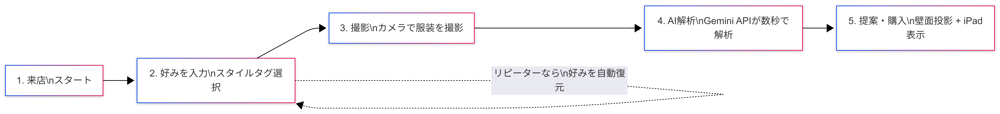
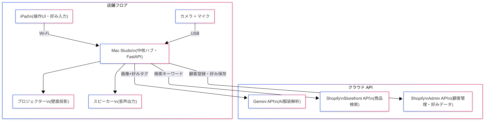
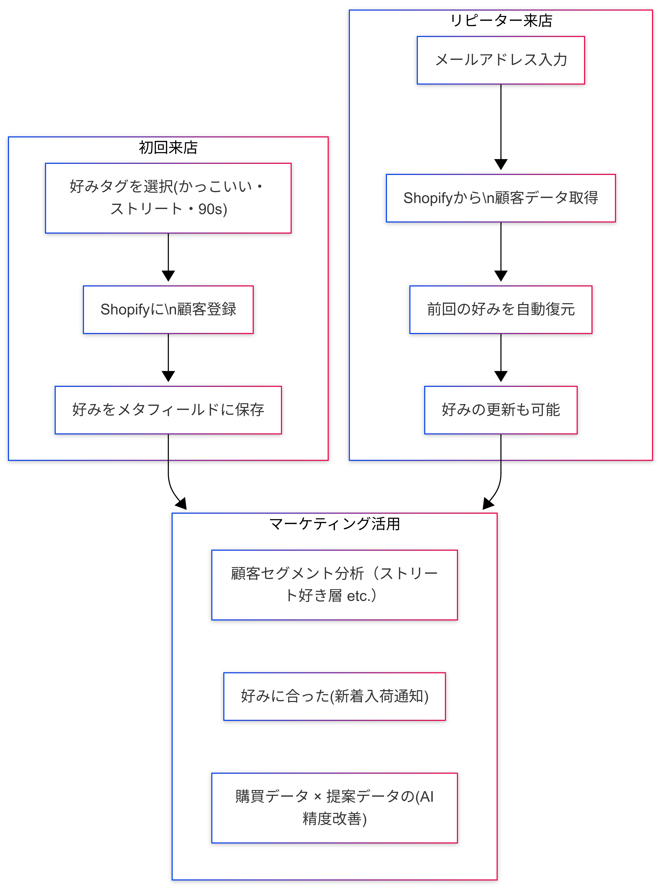

# 85-Store AI店員システム 導入プロジェクト
## 富山県中小企業トランスフォーメーション補助金 活用企画

**実施店舗:** 85-Store (富山県南砺市井波)

---

## 申請事業者・連携体制

* **実施主体（申請者）: 85-Store (ハコストア)**
  * 実店舗およびオンラインストア（Shopify）の運営、実証フィールドの提供。
* **システム・AI開発担当: 85-Store（自社内製）**
  * テクニカルな実装（AI連携、Shopify在庫連携、UI設計、システム構築）を自社で主体的に行い、社内に強力なDXノウハウを蓄積。
* **映像・演出・音響担当: WA/VE**
  * 店舗空間のプロジェクションマッピング映像制作、音響システムの設計・最適化。

---

## 補助金申請の背景と目的 (1/2)
**トランスフォーメーションの実現**

### 1. 省力化・省人化による生産性向上
* 実店舗における接客の一部（お客様の好みのヒアリング、それに合う商品の提案、在庫確認）を**AIシステムで代替・自動化**。
* 少人数で効率的な店舗運営（WEEKEND LIMITED STOREの効率化や平日稼働の検討）を可能にし、スタッフはより高度で人間的な接客や店舗運営業務に専念。

---

## 補助金申請の背景と目的 (2/2)

### 2. DXによる業務プロセス・事業構造の変革
* オフライン（実店舗）のお客様の服装データと、オンライン（Shopify）の在庫データをシームレスに結合。
* いわゆる **OMO（Online Merges with Offline）** を実現し、他にはない新たな顧客体験を提供し、店舗の競争力を強化。

### 3. 顧客情報のデジタル化と活用
* 来店時にお客様のスタイルの好み（かっこいい・かわいい・ナチュラル等）をデジタルで取得し、**Shopifyの顧客データと直接紐づけて蓄積**。
* リピーター来店時には過去の好みデータを即座に復元し、**パーソナライズされた提案**を実現。従来スタッフの記憶に頼っていた顧客理解をシステム化。
* 蓄積された好みデータを活用し、顧客セグメント別のマーケティング（好みに合った新着入荷通知等）への展開が可能。

---

## プロジェクトの概要（体験イメージ）
**「"今好きなもの"が"ずっと好きなもの"をつくる」体現**

お客様の当日の服装とスタイルの好みをAIが総合的に解析し、一人ひとりに最適な「一点モノ」の古着をリアルタイム在庫から提案。

1. **好みの入力（iPad）**:
   お客様が好みのスタイルタグ（かっこいい・かわいい・ストリート・90s等）を選択。Shopify顧客データと紐づけて保存し、リピーターは即座に好みを復元。
2. **AI接客（iPad + カメラ）**:
   高画質カメラで姿を捉え、**好みタグ + 服装画像**を最新AI（Gemini API）に送信。好みを加味した高精度なスタイリング提案を生成。
3. **空間演出（プロジェクションマッピング）**:
   提案商品は店舗の壁一面にダイナミックに投影。没入感のあるショッピング体験を提供（演出・音響: WA/VE）。

---

## ユーザーフロー（お客様の体験ステップ）

1. **来店・スタート:** iPadの画面をタップして体験開始
2. **好みを入力:** スタイルタグ（かっこいい/かわいい/90s等）をタップで選択。名前とメールを入力。リピーターはメール入力で前回の好みが自動復元
3. **撮影:** カメラの前に立ち、今日の服装を撮影
4. **AI解析:** 服装画像 + 好みタグをAI（Gemini）が数秒で解析
5. **提案・購入:** 好みに合った古着を最大3パターン提案。壁面にプロジェクション投影。QRコードからその場でEC購入も可能

---

## システム概要図

---

## 導入するシステム構成（技術概要）
**Mac Studioを中心とした集約型アーキテクチャ**

高度な画像認識と映像・音響演出を低遅延で両立。顧客データの蓄積・活用をShopifyプラットフォームに統合。

* **中核ハブ (Mac Studio):** カメラ認識、AI通信、API連携、プロジェクションマッピング映像生成・音響制御を一括処理する強力なコア。
* **操作端末 (iPad):** お客様の手元で動作するリモートUI兼ストリーミング端末。好みの入力やAI提案の閲覧を行う。
* **空間デバイス:** 超短焦点/高輝度プロジェクターと店舗用スピーカーシステム。
* **ソフトウェア構成:** React (UI), Python/FastAPI (バックエンド), Gemini 2.5 Flash API (AI), Shopify Storefront API (在庫検索), Shopify Admin API (顧客管理・好みデータ), TouchDesigner等 (映像演出)

---

## 顧客データ活用の仕組み

---

---

## 期待される導入効果

1. **接客の効率化・省人化**:
   AIによる一次接客・提案を活用し、1組あたりの対応時間を削減。来店ピーク時も少人数で的確な対応が可能。
2. **顧客単価・コンバージョン率の向上**:
   お客様自身の服と**好みのスタイル**をベースにした高精度パーソナライズ提案と、プロジェクションマッピングの視覚体験により購買意欲を強く刺激。
3. **オンライン連動の強化**:
   実店舗から裏側のEC在庫（Shopify）へスムーズにアクセス。QRコード決済等を活用したECへのシームレスな誘導で売上の最大化を図る。
4. **顧客情報DXによるリピーター獲得**:
   来店ごとの好みデータをShopifyに蓄積。リピーター来店時は即座にパーソナライズ接客を開始でき、**「覚えていてくれる店」**としてのロイヤルティ向上と再来店促進を実現。

---

## 想定予算規模（概算: 合計 約 1,850,000 円）
※補助金の対象経費項目に合わせて申請時に調整

**【ハードウェア・設備費（機械装置・システム構築費 等）】**
* ホストPC（Mac Studio 等）: 約 300,000円
* オペレーション用接客端末（iPad 等）: 約 100,000円
* 高精度カメラ・全指向性マイク: 約 50,000円
* 超短焦点プロジェクター: 約 300,000円
* 空間演出用音響システム: 約 100,000円

**【ソフトウェア開発・外注費・ライセンス 等】**
* 空間映像演出・音響製作（WA/VE 様 委託）: 約 800,000円
* AI/EC連携・UIシステム基盤構築（自社実装・ライセンス等）: 約 200,000円

